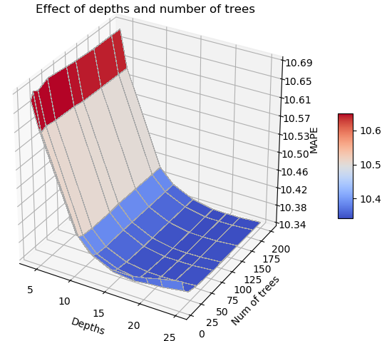
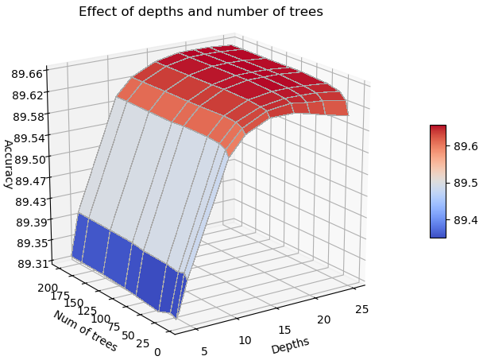
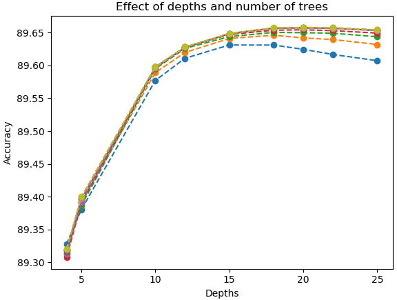
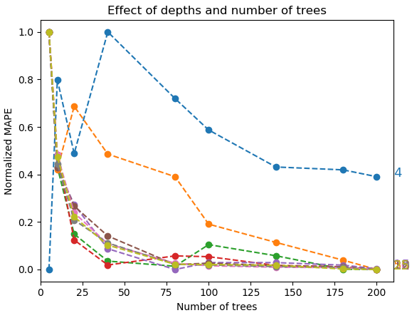

# Predict the drive speed for a car using Uber movement data

This example will walk you through how to use Uber movement data to conduct the speed prediction at street level. 

## Data sources

- Uber movement data
Data were downloaded from [Uber movement website](https://movement.uber.com/?lang=en-US).

We use the data from Seattle area as an example. The data is from the month of Feb, 2020. The geographical area of the downloaded data is defined by the following gps coordinates (-122.447676, 47.510547, -122.265260, 47.734649).
The picture below shows an area of the data that is downloaded for this project. 

Uber movement data includes travel time data and speed data. 
Travel time data were aggregated based on the GeoJson data for the city that you select. 
Speed data contains the aggregated speed data based on hour, day or quarter. It has higher level of resolution at the street level. 

In this project, we use speed data. 

Uber movement data also contains GeoJson data for the city. It contains the geography information for each street, such as coordinates of the street's start node and end node, osmwayid which is very useful to find the street's other information when combined with any other map data source. 

- Weather data
In this data file, we also merged some weather information for the street at a given travel time (hour of a day), weather data was downloaded from [weather underground](https://www.wunderground.com/).

## Data file in this repository

Our project was using a much larger data file with total number of 3481341 observations to conduct training and testing. Here, we only a small data file 'hist_adj_select_samll.csv' to demonstrate the workflow, which contains 104202 records.

## model training

We build a Random Forest based regression model. We use mean absolite percentage error (MAPE) to quantify the model's performance.

We have done some prelimenary analysis to understand the features and hyperparameter tunning. PLEASE NOTE THAT THE NOTEBOOK IN THIS REPOSITORY DO NOT SHOW THE ML EXPERIMENTAL RESULTS, but rather than a walk through of how to ultilize the data to train a model. 

At last, we decided to use only 4 features to train the model, because the rest of the features are not making significant contribution to the model's performance (see the notebook for more details). We also decided to use number of trees of 100, and depth of 18 for our final project.

Here is a quick glance of the ML experimental results. 

Hyperparameter tuning results based on MAPE.

Then, MAPE was plotted against number of depth, each curve is for a number of trees.

Hyperparameter tuning results based on accuracy.

Then, accuracy was plotted against number of depth, each curve is for a number of trees.

From the results above, we conclude that the number of depth has more impact on the model's performance compared to the number of trees. 

In order to visualize better how the number of trees are impact our results, we have aslo plotted MAPE against number of trees, while each curve is representing a certain depth. Each curve is normalized based on its first value. 

## Further application

In a trip recommendation project, we used the model trained from this project to conduct the speed prediction. The pre-trained model was hosted in the backend by an API. At front end, a graph search algorithm repeatively calls the model from the backend to get predicted speed to guide the graph search process. More details about the trip recommendation project, please refer [here](https://github.com/SYAN83/trip-recom). 

